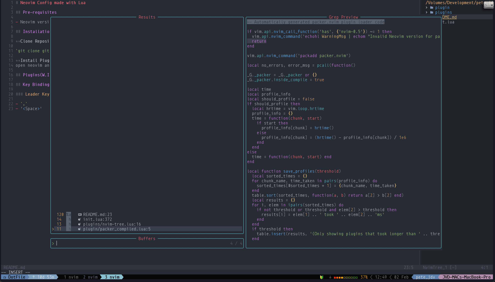

# Neovim Config made with Lua

## Pre-requisites

- Neovim version > [v0.8.2](https://github.com/neovim/neovim/wiki/Installing-Neovim)

## Installation

**Clone Repository and set as default nvim config**

`git clone git@github.com:redjoker011/nvim_lua.git ~/.config/nvim`

**Install Plugins using Packer**
open neovim and run `:PackerInstall` command

## Plugins

### Package Mananger
- [packer](https://github.com/wbthomason/packer.nvim)

### LSP, Linter, Parser and Auto Complete
- [nvim-lspconfig](https://github.com/neovim/nvim-lspconfig)
- [nvim-cmp](https://github.com/hrsh7th/nvim-cmp)
- [nvim-treesitter](https://github.com/nvim-treesitter/nvim-treesitter)

### Git Tools
- [vim-fugitive](https://github.com/tpope/vim-fugitive)
- [vim-rhubarb](https://github.com/tpope/vim-rhubarb)

### Theme and Status Line
- [onedark](https://github.com/joshdick/onedark.vim)
- [lualine](https://github.com/nvim-lualine/lualine.nvim)
- [gitsigns](https://github.com/lewis6991/gitsigns.nvim)

### Indentation, Comments and more
- [vim-surround](https://github.com/tpope/vim-surround)
- [auto-pairs](https://github.com/jiangmiao/auto-pairs)
- [indent-blankline](https://github.com/lukas-reineke/indent-blankline.nvim)
- [Comment](https://github.com/numToStr/Comment.nvim)

### Floating Buffer and Window control
- [vim-sleuth](https://github.com/tpope/vim-sleuth)
- [telescopic](https://github.com/nvim-telescope/telescope.nvim)

### Tree Directory
- [nvim-tree](https://github.com/nvim-tree/nvim-tree.lua)

## Key Bindings

### Leader Key 

- `,`
- '<Space>'

### Common Key Bindings

**<Leader\>** means you have to either hit `Space` bar or `,`

**<C-w-s\>** means you have to hit Ctrl followed by w and s

**<Leader\>sf**  means you have to hit the Leader key(Space | ,) followed by s and f

 

| Key Binding | Description 		   				|  Plugin 		       |
| ----------------- | ------------------------------------------------------- | ------------------------------ |
| <C-w-s\>          | Open new window in horizontal mode      		      |   		               |
| <C-w-v\>          | Open new window in vertical mode        		      |              		       |
| I                 | Insert Mode        				      |              		       |
| Esc	            | Exit Insert Mode        				      |                                |
| <Leader\>?        | Find recently opened files         		      |     Vim Telescope              |
| <Leader\><Space\> | View existing buffers              		      |     Vim Telescope              |
| <Leader\>sf       | Search File in directory           		      |     Vim Telescope              |
| <Leader\>sh       | Search Help tags                   		      |     Vim Telescope              |
| <Leader\>sg       | Search for word or regrexp using Grep in directory      |     Vim Telescope              |
| <Leader\>sd       | Search Diagnostics				      |     Vim Telescope              |
| <Leader\>v        | Toggle Nvim Tree			      	              |     Nvim Tree	               |
| <C\>v             | Open file in vertical split		      	      |     Nvim Tree	               |
| <C\>x             | Open file in horizontal split		      	      |     Nvim Tree	    |

